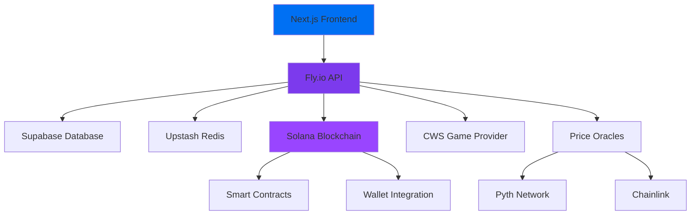

# 🎰 SOLS.BET - Premier On-Chain Casino

<div align="center">
  
  
  <p><em>The future of gambling - A next-generation casino gaming platform built on Solana blockchain</em></p>
  
  [](https://sols.bet)
  [](https://solana.com)
  [](https://nextjs.org)
  [](LICENSE)
</div>

---

## 🌟 Overview

**SOLS.BET** is the first ever open-source casino platform that brings transparency, fairness, and instant payouts to online gaming. Built on the Solana blockchain, it offers provably fair games, smart vault technology, and a native token ecosystem that rewards players and token holders alike.

### ✨ Key Features

- 🔐 **Non-Custodial**  You control your funds at all times
- 🎯 **Provably Fair Gaming** - All games use verifiable randomness on-chain
- ⚡ **Instant Payouts** - Lightning-fast transactions powered by Solana
- 🛡️ **Smart Vault Technology** - Secure, automated fund management
- 💎 **Gem Rewards System** - Earn gems for exclusive rewards  
- 🎮 **Premium Game Selection** - Slots, classics, and live games
- 📱 **Mobile-First Design** - Optimized for all devices

---

## 🚀 Live Platform

**Experience SOLS.BET now:** [https://sols.bet](https://sols.bet)

- 🌐 **Mainnet**: Coming Soon
- 🧪 **Devnet**: Currently Live for Testing
- 📱 **Mobile**: Fully responsive web app

---

## 🛠️ Tech Stack

### Frontend
- **Framework**: Next.js 14 (React 18)
- **Styling**: Tailwind CSS + Custom Design System
- **Animations**: Framer Motion + React Spring
- **Wallet Integration**: Solana Wallet Adapter
- **State Management**: Zustand + React Query
- **UI Components**: Radix UI + Custom Components

### Backend
- **Runtime**: Node.js
- **Database**: Supabase (PostgreSQL)
- **Cache**: Upstash Redis
- **Deployment**: Fly.io
- **Monitoring**: Sentry

### Blockchain
- **Network**: Solana (Devnet/Mainnet)
- **Smart Contracts**: Anchor Framework (Rust)
- **RPC**: Custom Solana RPC endpoints (Helius)
- **Price Feeds**: Pyth Network + Chainlink

### Game Integration
- **Provider**: [https://www.casinowebscripts.com/]CWS (Casino Web Scripts)
- **Games**: 20+ Premium Slots & Table Games
- **API**: Custom game ticket & balance management

---

## 🎮 Game Portfolio

### 🎰 **Slot Games**
- Mystic Books
- Pyramid Riches II
- The Legend of Count Dracula
- Treasure of the Wild Bears
- Bitcoin Billion
- Queen Mermaid Deluxe
- Fruit Party Non Stop
- *...and more*

### 🃏 **Classic Games**
- Blackjack
- Roulette
- Plinko
- Mines
- Coin Flip
- *...and more*
---

## 🏗️ Architecture



### Core Components

#### **Smart Vault System**
- Automated fund management
- Multi-signature security
- Instant settlement
- Cross-game balance sharing

#### **Game Integration Layer**
- Seamless game provider integration
- Real-time balance synchronization
- Session management
- Provably fair verification

#### **Reward System**
- Gem collection mechanics
- Leaderboard tracking
- Achievement system

---

## 🚀 Getting Started

### Prerequisites

- Node.js 18+ 
- npm/yarn
- Git
- Solana CLI (for development)

### Installation

1. **Clone the repository**
   ```bash
   git clone https://github.com/your-username/sols-bet.git
   cd sols-bet
   ```

2. **Install dependencies**
   ```bash
   npm install
   ```

3. **Set up environment variables**
   ```bash
   cp .env.example .env.local
   ```
   
   Configure the following variables:
   ```env
   # Solana Configuration
   NEXT_PUBLIC_RPC_ENDPOINT=https://api.devnet.solana.com
   NEXT_PUBLIC_NETWORK=devnet
   
   # Database
   NEXT_PUBLIC_SUPABASE_URL=your_supabase_url
   NEXT_PUBLIC_SUPABASE_ANON_KEY=your_supabase_key
   
   # Redis Cache
   UPSTASH_REDIS_REST_URL=your_redis_url
   UPSTASH_REDIS_REST_TOKEN=your_redis_token
   
   # Game Provider
   CWS_API_KEY=your_cws_api_key
   CWS_ENCRYPTION_KEY=your_encryption_key
   ```

4. **Run the development server**
   ```bash
   npm run dev
   ```

5. **Open your browser**
   Navigate to [http://localhost:3000](http://localhost:3000)

### Backend Setup

1. **Navigate to worker directory**
   ```bash
   cd worker
   npm install
   ```

2. **Start the backend services**
   ```bash
   # Start API server
   npm run api
   
   # Start worker processes (separate terminal)
   npm run worker
   ```

---

## 📚 API Documentation

### Core Endpoints

| Endpoint | Method | Description |
|----------|--------|-------------|
| `/games/ticket` | POST | Generate game session tickets |
| `/getbalance` | POST | Retrieve user balance |
| `/balance_adj` | POST | Adjust user balance |
| `/live-wins` | GET | Fetch recent wins |
| `/wallet-balance` | GET | Get wallet balance |
| `/user-smart-vault` | GET/POST | Smart vault management |
| `/gem-leaderboard` | GET | Gem collection leaderboard |

### Authentication

All API requests require proper authentication:
- **Frontend**: Solana wallet signatures
- **Game Provider**: HMAC-signed requests
- **Admin**: API key authentication

---

## 🎨 Design System

### Color Palette
- **Primary**: `#FFD700` (Rich Gold)
- **Secondary**: `#4C1D95` (Dark Luxury Purple)
- **Background**: `#0F0B1A` (Deep Dark)
- **Cards**: `#1A1625` (Card Medium)
- **Accent**: `#7C3AED` (Purple)

### Typography
- **Headings**: Recoleta (Custom)
- **Body**: Inter (System)
- **Monospace**: JetBrains Mono

### Components
- Fully responsive design
- Accessibility-first approach
- Custom animations
- Dark mode optimized

---

## 🔐 Security Features

### Smart Contract Security
- Multi-signature wallets
- Time-locked operations
- Audit-ready code
- Emergency pause mechanisms

### Application Security
- Session validation
- CSRF protection
- Rate limiting
- Input sanitization
- Secure API endpoints

### User Security
- Non-custodial architecture
- Encrypted data transmission
- Secure wallet integration
- Privacy-focused design

---

## 🧪 Testing

### Run Tests
```bash
# Frontend tests
npm test

# Smart contract tests
npm run test

# Vault balance tests
npm run test:vault-balances

# Real transaction tests
npm run test:real-tx
```

### Test Coverage
- Unit tests for core functions
- Integration tests for API endpoints
- Smart contract tests
- End-to-end user flows

---

## 📊 Monitoring & Analytics

### Performance Monitoring
- **Vercel Analytics** - User behavior tracking
- **Speed Insights** - Performance metrics
- **Sentry** - Error tracking
- **Custom Metrics** - Business KPIs

### Health Checks
- API endpoint health
- Database connectivity
- Redis cache status
- Smart contract operations
- Game provider integration

---

## 🚀 Deployment

### Frontend (Vercel)
```bash
npm run build
npm run start
```

### Backend (Fly.io)
```bash
cd worker
fly deploy
```

### Smart Contracts
```bash
anchor build
anchor deploy --provider.cluster devnet
```

---

## 🤝 Contributing

We welcome contributions! Please see our [Contributing Guide](CONTRIBUTING.md) for details.

### Development Workflow
1. Fork the repository
2. Create a feature branch
3. Make your changes
4. Add tests
5. Submit a pull request

### Code Standards
- ESLint + Prettier
- TypeScript strict mode
- Comprehensive tests
- Documentation updates

---

## 📄 License

This project is licensed under the MIT License - see the [LICENSE](LICENSE) file for details.

---

## 🌐 Links & Resources

- **🎮 Live Platform**: [sols.bet](https://sols.bet)
- **🐦 Twitter**: [@solsbet](https://twitter.com/solsbet)
- **💬 Discord**: [Join Community](https://discord.gg/solsbet)
- **📧 Contact**: [hello@sols.bet](mailto:hello@sols.bet)

---

## 🙏 Acknowledgments

- **Solana Foundation** - Blockchain infrastructure
- **CasinoWebScripts** - Game provider partnership
- **Pyth Network** - Price feed oracles
- **Supabase** - Database infrastructure
- **Vercel** - Frontend hosting
- **Fly.io** - Backend deployment

---

<div align="center">
  <p><strong>Built with ❤️ for the Solana ecosystem</strong></p>
  <p>© 2025 SOLS.BET. All rights reserved.</p>
</div>
